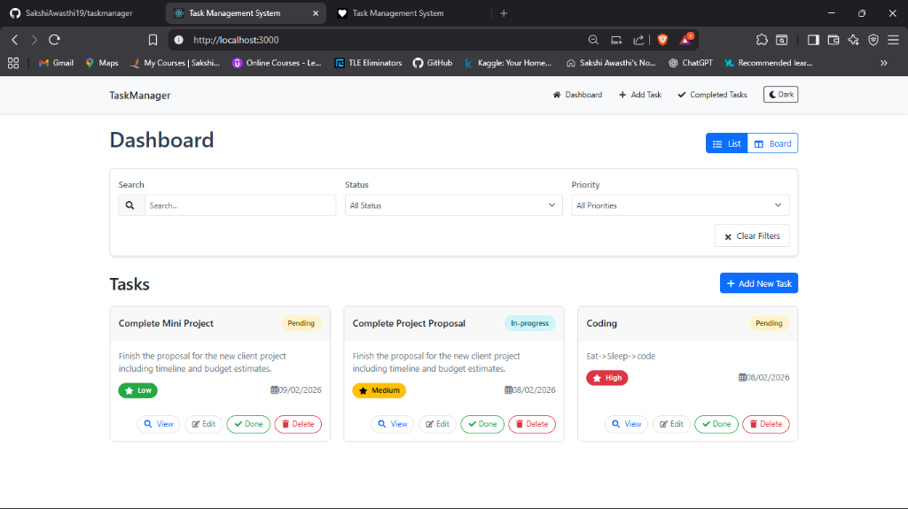
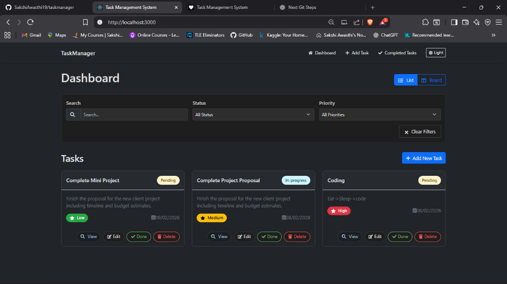

  # Task Manager

A full-stack web application for managing your daily tasks, built with React, Redux, Node.js, Express, MongoDB, Bootstrap, and jQuery.

## 🚀 Project Overview
The Task Manager helps you organize, track, and manage your tasks efficiently. You can add, edit, delete, and view tasks, as well as mark them as pending, in-progress, or completed. The dashboard provides a clear overview of all your tasks with a modern, responsive UI.

## ✨ Features

### 🔐 User Authentication
- **Secure Access**: Register and Login with email and password.
- **JWT Authentication**: Data privacy ensuring you only see your own tasks.
- **Profile Management**: Update your name, email, and password via the Account Modal.
- **Account Controls**: Logout and Delete Account options available.


### 📊 Analytics & Reporting
- **Productivity Dashboard**: Visual breakdown of your task progress.
- **Weekly Trends**: Interactive Bar and Line charts showing tasks completed over the last 7 days.
- **Streak Counter**: Track your consistency with a daily streak counter.
- **Key Stats**: Instant view of Total, Completed, and Pending tasks.


### 🎨 Modern UI & UX
- **Kanban Board**: Drag-and-drop tasks between states.
- **Dark Mode**: Seamless toggle with persistent preference.
- **Responsive Design**: Optimized for all devices.
- **Interactive Elements**: Smooth transitions, hover effects, and animated components.




## 🛠️ Tech Stack
- **Frontend:** React, Redux, Bootstrap, jQuery, jQuery UI
- **Backend:** Node.js, Express.js
- **Database:** MongoDB

## 📦 Setup Instructions

### Prerequisites
- Node.js & npm
- MongoDB (running locally on default port)

### 1. Clone the repository
```bash
git clone <your-repo-url>
cd taskmanager
```

### 2. Install dependencies
#### Backend (Root Directory)
```bash
npm install
```
#### Frontend
```bash
cd client1
npm install
cd ..
```

### 3. Start the application
#### Start MongoDB (if not already running)
Make sure your MongoDB server is running locally on `mongodb://localhost:27017`.

#### Run Both (Recommended)
You can run both the backend and frontend concurrently with a single command from the root directory:
```bash
npm run dev:full
```

#### Or Run Individually
**Backend:**
```bash
npm run dev
# OR
node server.js
```

**Frontend:**
```bash
cd client1
npm start
```

### 4. Open in Browser
Visit [http://localhost:3000](http://localhost:3000) to use the Task Manager.

## 🖥️ Usage
- **Dashboard**: View active tasks (Pending/In-Progress). Use filters to search or sort.
- **View Task**: Click "View" on a card to see full details in a read-only page.
- **Completed Tasks**: Access the "Completed Tasks" page from the Navbar to see finished work.
- **Add Task**: Click "+ Add Task" in the Navbar or Dashboard.
- **Edit Task**: Click "Edit" on a card or "Edit Task" in the details view to modify.
- **Mark Complete**: Click "Done" on a card or "Mark as Complete" in details to move to Completed list.

## 📁 Project Structure
```
taskmanager/
├── client1/         # React frontend
├── server.js       # Express backend
└── ...
```

## 🙏 Credits
- [React](https://reactjs.org/)
- [Redux](https://redux.js.org/)
- [Bootstrap](https://getbootstrap.com/)
- [jQuery](https://jquery.com/)
- [jQuery UI](https://jqueryui.com/)
- [Node.js](https://nodejs.org/)
- [Express](https://expressjs.com/)
- [MongoDB](https://www.mongodb.com/)

---

Feel free to customize and enhance this project for your needs! 

